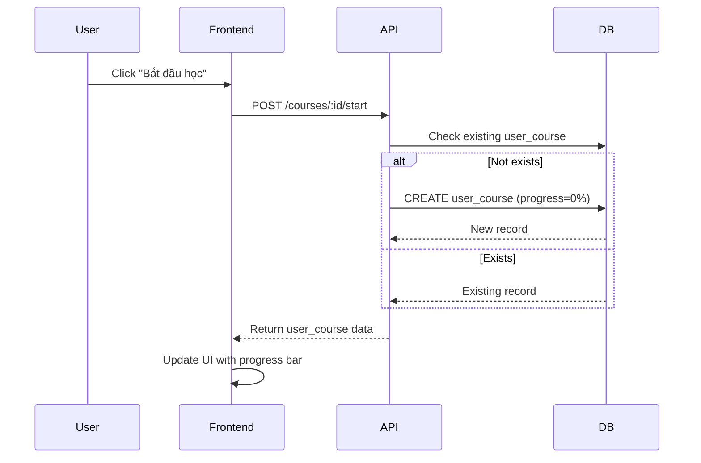
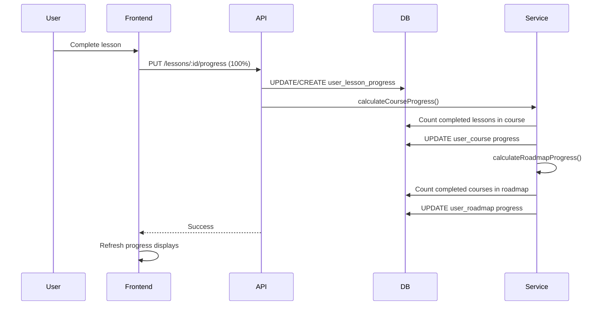

# User Progress Tracking API Guide

Hệ thống tracking tiến trình học tập cho Course và Roadmap, tự động cập nhật tiến độ dựa trên lesson completion.

## Table of Contents

- [Overview](#overview)
- [APIs](#apis)
- [Data Flow](#data-flow)
- [Usage Examples](#usage-examples)

## Overview

### Mô hình Tracking

```
Lesson Progress → Course Progress → Roadmap Progress
```

Khi user hoàn thành một lesson:

1. `User_Lesson_Progress` được cập nhật
2. Tự động tính lại `User_Course` progress (dựa trên % lessons completed)
3. Tự động tính lại `User_Roadmap` progress (dựa trên % courses completed)

### Database Tables

- **user_courses**: Tracking course enrollment và progress
- **user_roadmaps**: Tracking roadmap enrollment và progress
- **user_lesson_progresss**: Tracking individual lesson progress

---

## APIs

### 1. Start Course

Bắt đầu một khóa học (tạo user_course record nếu chưa có).

**Endpoint:** `POST /api/user/courses/:id/start`

**Authentication:** Required (Bearer Token)

**Request:**

```http
POST /api/user/courses/1/start
Authorization: Bearer {token}
```

**Response (201 - Created):**

```json
{
  "success": true,
  "message": "Course started successfully",
  "isNew": true,
  "data": {
    "user_course_id": 1,
    "user_id": 123,
    "course_id": 1,
    "started_at": "2026-03-12T10:00:00.000Z",
    "completed_at": null,
    "progress_percentage": 0.0,
    "is_completed": false,
    "created_at": "2026-03-12T10:00:00.000Z",
    "updated_at": "2026-03-12T10:00:00.000Z"
  }
}
```

**Response (200 - Already Started):**

```json
{
  "success": true,
  "message": "Course already started",
  "isNew": false,
  "data": {
    "user_course_id": 1,
    "user_id": 123,
    "course_id": 1,
    "started_at": "2026-03-10T08:00:00.000Z",
    "completed_at": null,
    "progress_percentage": 45.5,
    "is_completed": false
  }
}
```

---

### 2. Start Roadmap

Bắt đầu một lộ trình (tạo user_roadmap record nếu chưa có).

**Endpoint:** `POST /api/user/roadmaps/:id/start`

**Authentication:** Required (Bearer Token)

**Request:**

```http
POST /api/user/roadmaps/2/start
Authorization: Bearer {token}
```

**Response:** Tương tự Start Course

---

### 3. Update Lesson Progress

Cập nhật tiến độ của một bài học. Tự động tính lại course và roadmap progress.

**Endpoint:** `PUT /api/user/lessons/:id/progress`

**Authentication:** Required (Bearer Token)

**Request:**

```http
PUT /api/user/lessons/10/progress
Authorization: Bearer {token}
Content-Type: application/json

{
  "progressPercentage": 100,
  "isCompleted": true
}
```

**Request Body:**
| Field | Type | Required | Description |
|-------|------|----------|-------------|
| progressPercentage | number | Yes | Tiến độ 0-100 |
| isCompleted | boolean | No | Đánh dấu hoàn thành |

**Response (200):**

```json
{
  "success": true,
  "message": "Lesson progress updated successfully",
  "data": {
    "user_lesson_progress_id": 5,
    "user_id": 123,
    "lesson_id": 10,
    "started_at": "2026-03-12T10:15:00.000Z",
    "completed_at": "2026-03-12T10:30:00.000Z",
    "progress_percentage": 100,
    "is_completed": true,
    "created_at": "2026-03-12T10:15:00.000Z",
    "updated_at": "2026-03-12T10:30:00.000Z"
  }
}
```

**Auto-Update Flow:**

```
UPDATE lesson progress
  ↓
CALCULATE course progress (completed_lessons / total_lessons)
  ↓
UPDATE user_course
  ↓
CALCULATE roadmap progress (completed_courses / total_courses)
  ↓
UPDATE user_roadmap
```

---

### 4. Get Course Progress

Lấy thông tin tiến độ course của user.

**Endpoint:** `GET /api/user/courses/:id/progress`

**Authentication:** Required (Bearer Token)

**Request:**

```http
GET /api/user/courses/1/progress
Authorization: Bearer {token}
```

**Response (200 - Started):**

```json
{
  "success": true,
  "data": {
    "started": true,
    "progress": {
      "user_course_id": 1,
      "user_id": 123,
      "course_id": 1,
      "started_at": "2026-03-10T08:00:00.000Z",
      "completed_at": null,
      "progress_percentage": 66.67,
      "is_completed": false,
      "created_at": "2026-03-10T08:00:00.000Z",
      "updated_at": "2026-03-12T10:30:00.000Z",
      "completedLessons": 8,
      "totalLessons": 12
    }
  }
}
```

**Response (200 - Not Started):**

```json
{
  "success": true,
  "data": {
    "started": false,
    "progress": null
  }
}
```

---

### 5. Get Roadmap Progress

Lấy thông tin tiến độ roadmap của user.

**Endpoint:** `GET /api/user/roadmaps/:id/progress`

**Authentication:** Required (Bearer Token)

**Request:**

```http
GET /api/user/roadmaps/2/progress
Authorization: Bearer {token}
```

**Response:** Tương tự Get Course Progress

**Data Include:**

```json
{
  "started": true,
  "progress": {
    "user_roadmap_id": 3,
    "user_id": 123,
    "roadmap_id": 2,
    "progress_percentage": 33.33,
    "is_completed": false,
    "completedCourses": 2,
    "totalCourses": 6
  }
}
```

---

### 6. Get Lesson Progress

Lấy thông tin tiến độ của một bài học.

**Endpoint:** `GET /api/user/lessons/:id/progress`

**Authentication:** Required (Bearer Token)

**Request:**

```http
GET /api/user/lessons/10/progress
Authorization: Bearer {token}
```

**Response (200):**

```json
{
  "success": true,
  "data": {
    "started": true,
    "progress": {
      "user_lesson_progress_id": 5,
      "user_id": 123,
      "lesson_id": 10,
      "started_at": "2026-03-12T10:15:00.000Z",
      "completed_at": "2026-03-12T10:30:00.000Z",
      "progress_percentage": 100,
      "is_completed": true
    }
  }
}
```

---

## Data Flow

### Starting a Course



### Updating Lesson Progress



---

## Usage Examples

### Frontend Integration

#### 1. Start Course Button

```tsx
import { useCourse } from "../contexts/courseContext";

const CourseDetail = () => {
  const { startCourse, getCourseProgress } = useCourse();
  const [progress, setProgress] = useState(null);

  const handleStart = async () => {
    await startCourse(courseId);
    const progressData = await getCourseProgress(courseId);
    setProgress(progressData);
  };

  return <button onClick={handleStart}>Bắt đầu học</button>;
};
```

#### 2. Display Progress

```tsx
const CourseProgress = ({ courseId }) => {
  const { getCourseProgress } = useCourse();
  const [progress, setProgress] = useState(null);

  useEffect(() => {
    const fetchProgress = async () => {
      const data = await getCourseProgress(courseId);
      setProgress(data);
    };
    fetchProgress();
  }, [courseId]);

  if (!progress?.started) {
    return <button>Bắt đầu học</button>;
  }

  return (
    <div>
      <div className="progress-bar">
        <div style={{ width: `${progress.progress.progress_percentage}%` }} />
      </div>
      <p>
        {progress.progress.completedLessons} / {progress.progress.totalLessons}{" "}
        bài học
      </p>
    </div>
  );
};
```

#### 3. Update Lesson on Completion

```tsx
const LessonPlayer = ({ lessonId }) => {
  const { updateLessonProgress } = useCourse();

  const handleComplete = async () => {
    await updateLessonProgress(lessonId, 100, true);
    // Auto-updates course and roadmap progress
  };

  return <button onClick={handleComplete}>Hoàn thành bài học</button>;
};
```

---

## Progress Calculation Logic

### Course Progress

```javascript
// Tính % dựa trên số lesson completed
const completedLessons = await User_Lesson_Progress.count({
  where: {
    user_id: userId,
    lesson_id: lessonIdsInCourse,
    is_completed: true,
  },
});

const progressPercentage = (completedLessons / totalLessons) * 100;
const isCompleted = completedLessons === totalLessons;
```

### Roadmap Progress

```javascript
// Tính % dựa trên số course completed
const completedCourses = await User_Course.count({
  where: {
    user_id: userId,
    course_id: courseIdsInRoadmap,
    is_completed: true,
  },
});

const progressPercentage = (completedCourses / totalCourses) * 100;
const isCompleted = completedCourses === totalCourses;
```

---

## Error Handling

### Common Errors

**401 Unauthorized**

```json
{
  "success": false,
  "message": "You must be logged in to start a course"
}
```

**400 Bad Request**

```json
{
  "success": false,
  "message": "Progress percentage must be between 0 and 100"
}
```

**404 Not Found**

```json
{
  "success": false,
  "message": "Course not found or inactive"
}
```

**500 Internal Server Error**

```json
{
  "success": false,
  "message": "Failed to update lesson progress"
}
```

---

## Best Practices

### 1. Idempotent Start Calls

- Gọi `startCourse/startRoadmap` nhiều lần không tạo duplicate records
- Check `isNew` flag để biết record vừa được tạo hay đã tồn tại

### 2. Atomic Progress Updates

- Mỗi lesson update tự động trigger course/roadmap recalculation
- Không cần manually update course progress

### 3. Real-time Progress Display

- Fetch progress sau mỗi lesson completion
- Cache progress data để giảm API calls
- Subscribe to progress updates nếu có WebSocket

### 4. Offline Support

- Queue lesson completions khi offline
- Sync khi online trở lại
- Merge conflicts dựa trên `updated_at`

---

## Frontend Context Methods

### CourseContext

```typescript
interface CourseContextType {
  startCourse: (course_id: number) => Promise<boolean>;
  getCourseProgress: (course_id: number) => Promise<{
    started: boolean;
    progress: UserCourseProgress | null;
  }>;
  updateLessonProgress: (
    lesson_id: number,
    progressPercentage: number,
    isCompleted?: boolean,
  ) => Promise<boolean>;
  getLessonProgress: (lesson_id: number) => Promise<{
    started: boolean;
    progress: LessonProgress | null;
  }>;
}
```

### RoadmapContext

```typescript
interface RoadmapContextType {
  startRoadmap: (roadmap_id: number) => Promise<boolean>;
  getRoadmapProgress: (roadmap_id: number) => Promise<{
    started: boolean;
    progress: UserRoadmapProgress | null;
  }>;
}
```

---

## Testing

### Manual Testing Steps

1. **Start Course**
   - Login as user
   - Go to course detail page
   - Click "Bắt đầu học"
   - Verify user_course created with progress=0%

2. **Complete Lessons**
   - Update lesson progress to 100%
   - Verify course progress calculation
   - Check if roadmap progress also updated (if applicable)

3. **Progress Display**
   - Refresh page
   - Verify progress bar shows correct percentage
   - Check completed/total lessons count

4. **Edge Cases**
   - Start course twice (should not duplicate)
   - Complete same lesson twice (should be idempotent)
   - Start roadmap without starting courses (allowed)
   - Complete all lessons → course should be marked complete

---

## Migration Notes

### Existing Data

- Chạy migration để tạo `user_courses`, `user_roadmaps`, `user_lesson_progresss` tables
- Existing users cần click "Bắt đầu học" để tạo tracking records
- No retroactive progress calculation

### Future Enhancements

- Add `last_accessed_at` timestamp
- Track time spent per lesson
- Add streak/gamification features
- Certificate generation upon roadmap completion
- Email notifications for milestones
